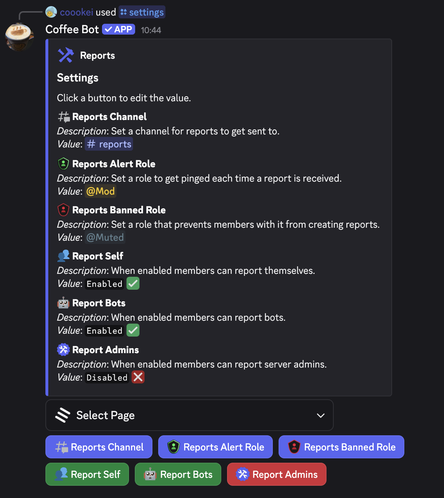
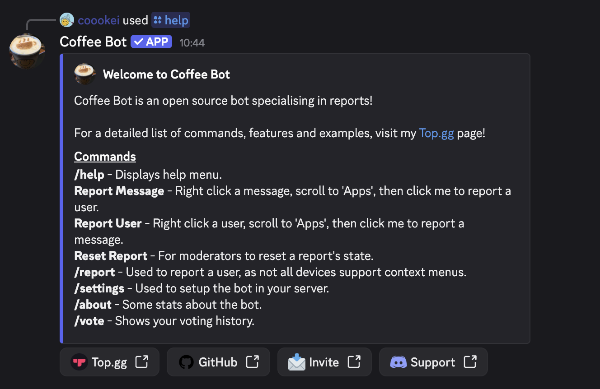

# Coffee Bot

Easily handle reports in your Discord server using context menus and text input modals. Featuring advanced audit logs showing who did what.

Coffee Bot is an open source, verified Discord bot built for moderation teams that want robust reporting tools.

### 🔗 [Invite Coffee Bot](https://discord.com/oauth2/authorize?client_id=950765718209720360&permissions=8&scope=bot%20applications.commands)

## Table of Contents

- [Features](#features)
- [Quick Start](#quick-start)
- [Commands](#commands)
- [Reporting Workflow](#reporting-workflow)
  - [Report a Message via Context Menu](#report-a-message-via-context-menu)
  - [Report a User via Context Menu](#report-a-user-via-context-menu)
  - [Report a User via Slash Command](#report-a-user-via-slash-command)
  - [Manage Report State](#manage-report-state)
- [Logging Coverage](#logging-coverage)
  - [Message Delete Logs](#message-delete-logs)
  - [Role Update Logs](#role-update-logs)
- [About Command](#about-command)
- [Support](#support)

## Features

- Reporting: use Discord context menus to submit message or user reports with detailed reasons for staff.
- Moderation filters included: configure invite, link, and chat filters with dedicated logging channels for quick follow-up.
- Transparent logging: capture message edits and deletions with attribution so you always know who deleted what, including bulk delete breakdowns.
- Member oversight: track nickname updates, timeouts, and role changes, and view the list of members attached to a role before it is deleted.
- Built-in audit: staff can mark reports as `Actioned` or `False Positive`, keeping the entire team up to date.

## Quick Start

1. Invite Coffee Bot to your server using the link above.
2. Ensure moderators have the `Manage Server` permission and members can `Use Application Commands`.
3. Run `/settings` to configure reporting, filters, and logging - navigate between categories with the dropdown menu.
4. Optional: designate log channels so Coffee Bot can archive moderation activity for future reference.

_Configure Coffee Bot via the `/settings` command and switch between categories._

## Commands

| Command        | Type         | Description                                            |
| -------------- | ------------ | ------------------------------------------------------ |
| Report User    | Context menu | Report a user with a reason prompt.                    |
| Report Message | Context menu | Report a message and capture context for staff review. |
| Reset Report   | Context menu | Reset the state of an existing report.                 |
| `/report`      | Slash        | Report a user with an optional image attachment.       |
| `/about`       | Slash        | Show bot statistics and recent commit history.         |
| `/help`        | Slash        | Display a list of available commands.                  |
| `/vote`        | Slash        | View voting information and related statistics.        |
| `/settings`    | Slash        | Configure reporting, filters, and log destinations.    |

_The `/help` command shows available Coffee Bot commands and descriptions._

## Reporting Workflow

### Report a Message via Context Menu

1. Right-click the message, open `Apps`, and choose **Report Message**.
2. Provide a reason in the modal and submit the report.
3. Review your submission in the confirmation view; staff receive the full context immediately.

### Report a User via Context Menu

1. Right-click the user, open `Apps`, and choose **Report User**.
2. Supply a reason for the report using the modal input.
3. Confirm the report and allow staff to review the details in their dedicated channel.

### Report a User via Slash Command

1. Run `/report`, select the member you want to report, and optionally attach an image for additional evidence.
2. Describe the incident in the reason field and submit.
3. Coffee Bot shares the report with your staff so they can take action.

### Manage Report State

- Use the green **Actioned** button when a report has been handled.
- Mark inaccurate submissions as **False Positive** to close the loop with your team.
- Moderators with `Manage Server` can reset a report via the **Reset Report** context menu command.

## Logging Coverage

### Message Delete Logs

- Receive confirmation when Coffee Bot or a staff member deletes a message.
- Track every message removed during bulk actions so nothing goes missing silently.

### Role Update Logs

- Get notified when members gain or lose roles, including who made the change.
- If a role is deleted, Coffee Bot lists every member who previously had it - perfect for rebuilding access quickly.

## About Command

The `/about` command highlights key statistics, version details, and recent commit information so you always know what is running in your server.

## Support

- Slash and context menu commands require the `Use Application Commands` permission.
- Found an issue or have feedback? Open a discussion or issue in this repository.
